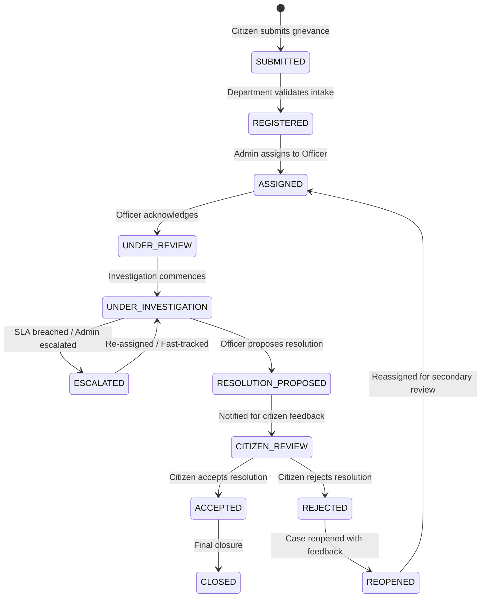

# System Architecture Specification

## Project: Blockchain-Based Public Grievance Tracking System

---

## 1. Architectural Overview & Philosophy

The **Blockchain-Based Public Grievance Tracking System** is architected to eliminate opacity, bureaucratic delays, and arbitrary dismissal of citizen grievances by anchoring the entire complaint lifecycle to an Ethereum-compatible EVM blockchain.

### Core Philosophy: Blockchain-as-Source-of-Truth
* **Zero Fake State**: The smart contracts hold canonical state. The frontend does not use `localStorage`, memory stores, mock JSON files, or simulated transactions to mimic state.
* **No Centralized Backend**: There is no Node.js, Express, FastAPI, Supabase, Firebase, or SQL database handling application logic or acting as a middleman.
* **Direct Web3 Protocol**: 
  ```
  React Frontend  ──[ Ethers.js ]──>  MetaMask  ──[ RPC ]──>  Solidity Contracts (EVM)
  ```
* **Remix IDE Native**: Every smart contract must be 100% self-contained, using stable Solidity compiler versions (`^0.8.20`), standard SPDX tags, and standard OpenZeppelin versioned imports compatible with Remix IDE.

---

## 2. Smart Contract Architecture

The smart contract layer is split into modular contracts, interfaces, and libraries to ensure maintainability, gas efficiency, and separation of concerns.

```
contracts/
├── GrievanceTypes.sol       # Enums, structs, constants, and custom errors
├── RoleManager.sol          # Multi-role access control system
├── DepartmentManager.sol    # Department directory and officer affiliations
├── GrievanceSystem.sol      # Core lifecycle, assignments, resolutions
├── EscalationManager.sol    # SLA timers, deadline tracking, escalation rules
└── AuditTrail.sol           # Immutable event logging & historical tracking

interfaces/
├── IRoleManager.sol
├── IDepartmentManager.sol
├── IGrievanceSystem.sol
├── IEscalationManager.sol
└── IAuditTrail.sol

libraries/
├── GrievanceLib.sol         # Helper logic and state validators
└── ValidationLib.sol        # String, address, and boundary validations
```

### Module Responsibilities

1. **`GrievanceTypes.sol`**:
   - Central definition point for enums (`Role`, `Status`, `Priority`, `Category`), structs (`GrievanceRecord`, `DepartmentRecord`, `OfficerRecord`, `ResolutionRecord`), constants, and custom error types.
2. **`RoleManager.sol`**:
   - Manages wallet-to-role mappings (`Citizen`, `Officer`, `Department Admin`, `Super Admin`).
   - Enforces modifiers and validation helpers consumed across contracts.
3. **`DepartmentManager.sol`**:
   - Registers government departments, assigns Department Admins, and manages active/inactive states.
   - Manages officer rosters, linking officer wallet addresses to specific department IDs.
4. **`GrievanceSystem.sol`**:
   - Manages grievance submission, ID generation, assignment to officers, status transitions, resolution proposals, and citizen review feedback.
   - Integrates with `DepartmentManager` and `RoleManager`.
5. **`EscalationManager.sol`**:
   - Calculates deadlines based on grievance priority and submission timestamps.
   - Triggers or permits grievance escalation when SLA thresholds are breached.
6. **`AuditTrail.sol`**:
   - Records chronological audit logs and emits comprehensive events for transparent off-chain indexing and dashboard tracking.

---

## 3. Role-Based Access Control (RBAC)

User identity is derived strictly from the active MetaMask wallet address:

| Role | Scope & Permissions |
| :--- | :--- |
| **Citizen** | Default role for any connected wallet address. Can submit grievances, submit additional evidence, propose re-opening, and accept/reject resolutions. |
| **Officer** | Government official assigned to a specific department. Can be assigned grievances, record investigation notes, update status, and propose resolutions. |
| **Department Admin** | Oversees an entire department. Can assign/reassign grievances to department officers, escalate stagnant grievances, and manage departmental officers. |
| **Super Admin** | System administrator (e.g., Public Grievance Ombudsman). Can create/deactivate departments, assign Department Admins, and adjust global SLA parameters. |

---

## 4. Grievance Lifecycle State Machine

The contract enforces deterministic state transitions. Transitions violating this lifecycle will revert on-chain.



---

## 5. Service Level Agreement (SLA) & Deadlines

Standard resolution deadlines are enforced based on priority tier:

| Priority | Configured SLA | Description |
| :--- | :--- | :--- |
| **CRITICAL** | 24 Hours | Imminent hazard, severe public safety disruption, life-threatening civic failures |
| **HIGH** | 3 Days | Major civic disruption, widespread utility outages, significant property risk |
| **MEDIUM** | 7 Days | Standard service disruptions, non-hazardous municipal complaints |
| **LOW** | 14 Days | Minor civic improvements, non-urgent maintenance, general feedback |

* Deadlines are computed using EVM block timestamps (`block.timestamp + SLA_DURATION`).
* If `block.timestamp > deadline` and status is not resolved, the grievance qualifies for automatic or authorized administrative escalation.

---

## 6. Off-Chain Evidence Architecture (IPFS)

To maintain minimal gas costs while ensuring data integrity:
1. Binary evidence files (images, PDFs, documents) are uploaded by the citizen or officer directly to IPFS.
2. The resulting IPFS Content Identifier (**CID**) is submitted to the smart contract as an immutable string reference.
3. The smart contract validates string boundaries and stores the CID alongside the submitter's wallet address and timestamp.

---

## 7. Frontend Integration Strategy

* **Framework**: React + Vite with Tailwind CSS.
* **Aesthetic Standard**: Institutional, accessible, professional, clean government/civic service interface.
* **Zero AI**: No conversational bots, predictive AI elements, or unnecessary animation overhead.
* **Contract Integration Workflow**:
  1. Contract authored and finalized in Remix IDE.
  2. Contract compiled and deployed to target test network.
  3. Deployed contract address and generated ABI copied directly to frontend configuration.
  4. Contract calls made strictly against deployed ABI functions with real MetaMask signing.
